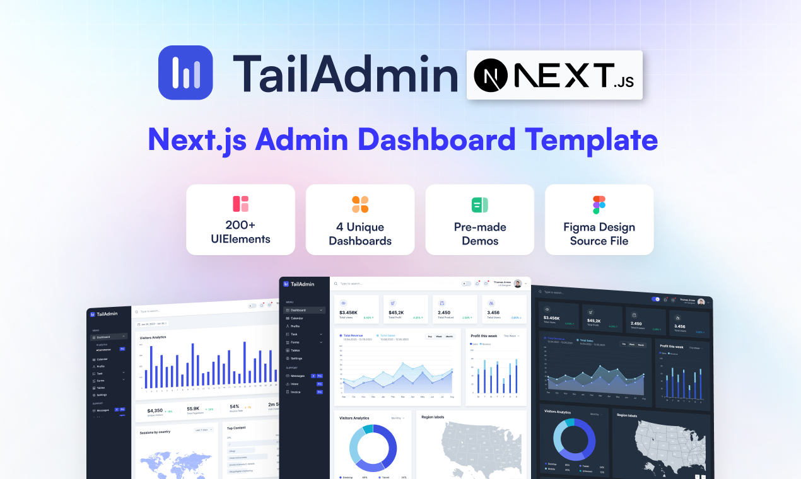

# 🧬 Atomica - AI-Powered Drug Discovery Platform

A modern, comprehensive drug discovery and molecular research platform built with Next.js, featuring AI-powered molecule generation and compound bioactivity analysis.



## ✨ Features

### 🎯 Core Functionality

- **AI-Powered Molecule Generation** - Generate novel molecular structures using advanced AI algorithms
- **Compound Bioactivity Analysis** - Integrated PubChem database for comprehensive bioactivity data
- **Molecular Database** - Browse and search through extensive compound libraries
- **Research Collaboration** - Connect with research community and share findings
- **Real-time Messaging** - XMTP-powered communication system
- **User Authentication** - Secure login/signup with NextAuth.js

### 🎨 Modern UI/UX

- **Responsive Design** - Optimized for all screen sizes
- **Dark Mode Support** - Toggle between light and dark themes
- **Smooth Animations** - Framer Motion and GSAP powered transitions
- **Modern Components** - Tailwind CSS v4+ with custom gradients
- **Interactive Dashboard** - Real-time stats and activity tracking

### 🔬 Scientific Tools

- **SMILES Support** - Chemical structure representation
- **2D Structure Visualization** - Interactive molecular diagrams
- **Bioactivity Search** - PubChem integration for compound analysis
- **Generation History** - Track and export molecular generation results
- **Advanced Filtering** - Search and filter compounds by properties

## 🚀 Getting Started

### Prerequisites

- Node.js 18+
- MongoDB database
- Git

### Installation

1. **Clone the repository**

```bash
git clone https://github.com/your-username/atomica.git
cd atomica
```

2. **Install dependencies**

```bash
npm install
```

3. **Set up environment variables**
   Create a `.env.local` file in the root directory:

```env
MONGODB_URL=your_mongodb_connection_string
NEXTAUTH_SECRET=your_nextauth_secret
NEXTAUTH_URL=http://localhost:3000
RESEND_KEY=your_resend_api_key
ABLY_API_KEY=your_ably_api_key
```

4. **Run the development server**

```bash
npm run dev
```

Open [http://localhost:3000](http://localhost:3000) to view the application.

## 🛠️ Tech Stack

### Frontend

- **Next.js 14** - React framework with App Router
- **TypeScript** - Type-safe JavaScript
- **Tailwind CSS** - Utility-first CSS framework
- **Framer Motion** - Animation library
- **GSAP** - Advanced animations
- **Lucide Icons** - Modern icon library

### Backend

- **MongoDB** - NoSQL database
- **Mongoose** - MongoDB object modeling
- **NextAuth.js** - Authentication
- **Resend** - Email service
- **Ably** - Real-time messaging

### Scientific Libraries

- **RDKit** - Cheminformatics toolkit
- **PubChem API** - Chemical database integration
- **NVIDIA MolMIM** - AI molecule generation

## 📁 Project Structure

```
atomica/
├── src/
│   ├── app/                  # Next.js app router pages
│   │   ├── auth-page/        # Authentication pages
│   │   ├── model/            # Molecule generation & bioactivity
│   │   ├── molecule-bank/    # Compound database
│   │   ├── research/         # Research collaboration
│   │   └── api/              # API routes
│   ├── components/           # React components
│   │   ├── ui/               # Reusable UI components
│   │   ├── dashboard/        # Dashboard components
│   │   └── Layouts/          # Layout components
│   ├── lib/                  # Utilities and actions
│   │   ├── actions/          # Server actions
│   │   ├── database/         # Database models
│   │   └── utils.ts          # Utility functions
│   └── types/                # TypeScript type definitions
├── public/                   # Static assets
└── tailwind.config.ts        # Tailwind configuration
```

## 🔬 Usage

### Generating Molecules

1. Navigate to the **Model** section
2. Enter a SMILES string or use examples
3. Adjust generation parameters
4. Click "Generate Molecules"
5. View results with 2D structure visualization

### Bioactivity Analysis

1. Go to **Model** → **Bioactivity** tab
2. Enter a compound name (e.g., "Aspirin")
3. Click "Search Bioactivity"
4. View comprehensive PubChem data in embedded iframe

### Molecule Bank

1. Browse the **Molecule Bank** section
2. Use filters to search specific compounds
3. View detailed molecular information
4. Export results for further analysis

## 🚀 Deployment

### Vercel (Recommended)

1. Push your code to GitHub
2. Connect your repository to Vercel
3. Add environment variables in Vercel dashboard
4. Deploy with one click

### Environment Variables for Production

```env
MONGODB_URL=your_production_mongodb_url
NEXTAUTH_SECRET=your_production_secret
NEXTAUTH_URL=https://your-domain.vercel.app
RESEND_KEY=your_resend_api_key
ABLY_API_KEY=your_ably_api_key
```

## 🤝 Contributing

We welcome contributions! Please follow these steps:

1. Fork the repository
2. Create a feature branch (`git checkout -b feature/amazing-feature`)
3. Commit your changes (`git commit -m 'Add amazing feature'`)
4. Push to the branch (`git push origin feature/amazing-feature`)
5. Open a Pull Request

## 📝 License

This project is licensed under the MIT License - see the [LICENSE](LICENSE) file for details.

## 🙏 Acknowledgments

- **NVIDIA** for MolMIM API
- **PubChem** for chemical database
- **RDKit** for cheminformatics tools
- **Vercel** for hosting platform
- **MongoDB** for database services

## 📧 Contact

For questions or support, please open an issue or contact:

- Email: krishna.chauhan2005@outlook.com | kratanjalichandel440@gmail.com
- GitHub: [krishna25092005](https://github.com/krishna25092005) | [kratanjali-chandel](https://github.com/kratanjali-chandel)

---

**Built with ❤️ for the scientific community**

🧬 Accelerating drug discovery through AI and modern web technologies
